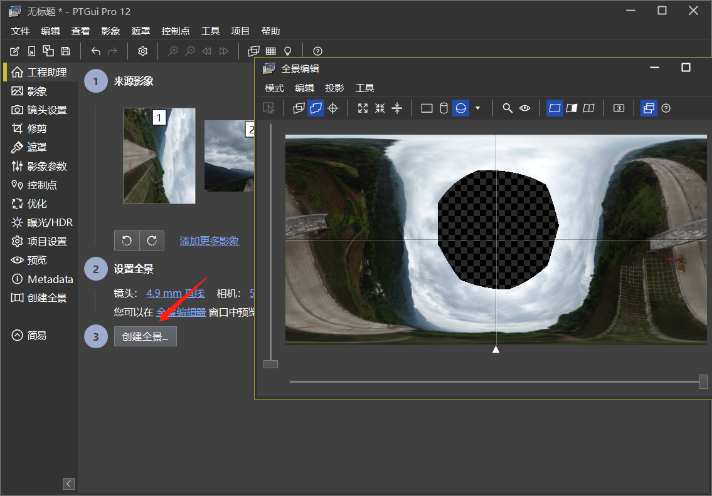
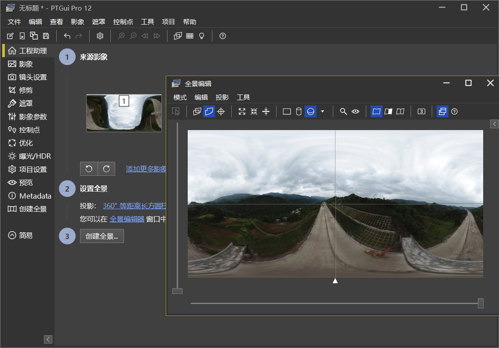

# para-view
大疆全景生成以及预览

## 全景生成步骤

1. 导入PTGui

2. 对齐后，在全景编辑器中鼠标点住最中间往下拖，直到拖出一个空心圆。(有可能拖不动，一直loading，此时关闭PTGui重来一次)。拖好后就可以关闭全景编辑窗口。

3. 点击创建全景导出全景图准备用ps编辑。

4. ps用套索选中空心圆，然后右键=》填充(选取尽量只选中空心圆，不然有可能使用到天以外的东西填充)：

5. 填充完成后直接导出最佳质量的图片

6. 用PTGui打开填充完的图片，然后再底部中心点往上拖，只到拖成一张正常的全景图，大功告成。(这一步还是比较重要，没弄好可能查看的时候拖动不是很流畅)

## 全景查看组件

<https://github.com/mpetroff/pannellum>

index.html可以预览